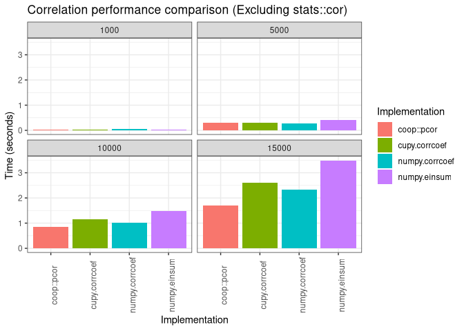

R/Python Correlation Performance Benchmark
==========================================

## Overview

This repository contains a basic pipeline for benchmarking the speed of various
approaches for assessing correlation of a numeric data matrix.

At present, the repo is focussed on implementations in R/Python, for random continuous
data on the order of a thousand to tens of thousands of variables, each containing 1000
values/observations.

Currently, only Pearson correlation approaches are benchmarked, however, in the future
other methods (Spearman, etc.) may be included.

## Methods

### Pearson Correlation

#### Python

- [numpy.corceff](https://docs.scipy.org/doc/numpy/reference/generated/numpy.corrcoef.html)
- [numpy.einsum](https://github.com/ikizhvatov/efficient-columnwise-correlation)
- [cupy.corrcoef](https://docs-cupy.chainer.org/en/stable/reference/generated/cupy.corrcoef.html)

#### R

- [stats::cor](https://www.rdocumentation.org/packages/stats/versions/3.6.1/topics/corj)
- [coop::pcor](https://www.rdocumentation.org/packages/coop/versions/0.6-2/topics/pcor)

## Usage

To run the benchmark pipeline, simply create a clone of the repo, edit the configuration file
(`config.yml`) to your liking.

Next, create a conda environment and run the pipeline using the following commands:

```sh
conda create -n benchmark-cor --file requirements.txt
conda activate benchmark-cor
snakemake --configfile config.yml -j<num_threads>
```

Where `<num_threads>` is the number of threads you want to allow
[snakemake](https://snakemake.readthedocs.io/en/stable/) to use when
executing the pipline.

## Results

| Method  | Language | Implementation | Num Rows | Time (Secs) |
| :------ | :------- | :------------- | -------: | ----------: |
| Pearson | Python   | numpy.corrcoef |     1000 |        0.05 |
| Pearson | Python   | numpy.corrcoef |     5000 |        0.29 |
| Pearson | Python   | numpy.corrcoef |    10000 |        1.02 |
| Pearson | Python   | numpy.corrcoef |    15000 |        2.52 |
| Pearson | Python   | numpy.corrcoef |    20000 |        4.42 |
| Pearson | Python   | numpy.corrcoef |    25000 |        6.49 |
| Pearson | Python   | numpy.corrcoef |    37500 |       14.04 |
| Pearson | Python   | numpy.corrcoef |    50000 |       25.36 |
| Pearson | Python   | numpy.einsum   |     1000 |        0.03 |
| Pearson | Python   | numpy.einsum   |     5000 |        0.46 |
| Pearson | Python   | numpy.einsum   |    10000 |        1.63 |
| Pearson | Python   | numpy.einsum   |    15000 |        3.65 |
| Pearson | Python   | numpy.einsum   |    20000 |        6.67 |
| Pearson | Python   | numpy.einsum   |    25000 |        9.14 |
| Pearson | Python   | numpy.einsum   |    37500 |       21.58 |
| Pearson | Python   | numpy.einsum   |    50000 |       42.10 |
| Pearson | R        | stats::cor     |     1000 |        0.66 |
| Pearson | R        | stats::cor     |     5000 |       17.16 |
| Pearson | R        | stats::cor     |    10000 |       71.99 |
| Pearson | R        | stats::cor     |    15000 |      167.05 |
| Pearson | R        | coop::pcor     |     1000 |        0.02 |
| Pearson | R        | coop::pcor     |     5000 |        0.28 |
| Pearson | R        | coop::pcor     |    10000 |        0.87 |
| Pearson | R        | coop::pcor     |    15000 |        1.76 |
| Pearson | R        | coop::pcor     |    20000 |        3.11 |
| Pearson | R        | coop::pcor     |    25000 |        4.41 |
| Pearson | R        | coop::pcor     |    37500 |       11.21 |
| Pearson | Python   | cupy.corrcoef  |     1000 |        0.02 |
| Pearson | Python   | cupy.corrcoef  |     5000 |        0.30 |
| Pearson | Python   | cupy.corrcoef  |    10000 |        1.17 |
| Pearson | Python   | cupy.corrcoef  |    15000 |        2.61 |




## System specs

- Arch Linux 64-bit (5.4.6)
- AMD Ryzen Threadripper 1950X 16-Core Processor
- 128G DDR4-2666 Mhz memory
- GeForce RTX 2060

## Notes

- All of the methods tested are able to compute pairwise correlations for a single data
  matrix, however, some methods (e.g. `stats::cor`, `coop::pcor`, and `numpy.einsum`)
  are also able to compute correlations between entries from two _different_ matrices.
- Due to GPU resource limitations, matrice larger than ~15,000 entries could not be tested
  with cupy.
- The parallelized correlation implementation of pearson correlation in R,
  `coop::pcor()` performed quite well for smaller datasets (~ 40,000 or fewer entries),
  however, it appears to run out of memory and segfault regularly at larger dataset
  sizes, whereas some of the other methods can scale up beyond 50,000 records on the
  same machine.
- All methods were found to produce highly similar results; small differences exist,
  likely due to floating point roundings errors and such.
- Since the purpose of this analysis was only to get rough sense of which method would perform
  best for the scales of data tested, the number of times each method was tested to
  produce the results above is quite small (10). For more precise results, a larger
  number of iterations should be run.

## See Also

- [github.com/ikizhvatov/efficient-columnwise-correlation](https://github.com/ikizhvatov/efficient-columnwise-correlation)
  - Comparison of several efficient methods for computing Pearson correlation between
    columns of two matrices.
  - This is the source of the `np.einsum()` method tested in this repo.
