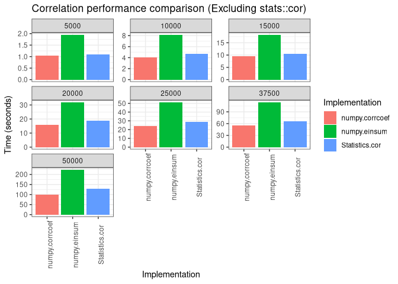

Julia/R/Python Correlation Performance Benchmark
================================================

## Overview

This repository contains a basic pipeline for benchmarking the speed of various
approaches for assessing correlation of a numeric data matrix.

At present, the repo is focussed on implementations in Julia/R/Python, for random
continuous data on the order of a thousand to tens of thousands of variables, each
containing 1000 values/observations.

Currently, only Pearson correlation approaches are benchmarked, however, in the future
other methods (Spearman, etc.) may be included.

## Methods

### Pearson Correlation

#### Python

- [numpy.corceff](https://docs.scipy.org/doc/numpy/reference/generated/numpy.corrcoef.html)
- [numpy.einsum](https://github.com/ikizhvatov/efficient-columnwise-correlation)

#### R

- [stats::cor](https://www.rdocumentation.org/packages/stats/versions/3.6.1/topics/corj)

#### Julia

- [Statistics::cor](https://docs.julialang.org/en/v1/stdlib/Statistics/#Statistics.cor)

## Usage

To run the benchmark pipeline, simply create a clone of the repo, edit the configuration file
(`config.yml`) to your liking.

Next, create a conda environment:

```sh
conda create -n benchmark-cor --file requirements.txt
conda activate benchmark-cor
```

Due to limited support for Julia in the conda repos, it must currently be installed
manually.

See the [Julia docs](https://julialang.org/downloads/) for instructions on how to
install Julia.

Once Julia has been installed, launch `julia` to open a Julia console instead, and run:

```julia
Using Pkg
Pkg.add("BenchmarkTools")
Pkg.add("NPZ")
```

Exit the julia REPL once the installation has completed.

The pipeline can now be run using the command:

```
snakemake --configfile config.yml -j1 --cores=<num_cores>
```

Where `<num_cores>` is the number of cpu cores you want to allow
[snakemake](https://snakemake.readthedocs.io/en/stable/) to use when executing the
pipline.

## Results

| Method  | Language | Implementation | Num Rows | Time (Secs) |
|:--------|:---------|:---------------|---------:|------------:|
| Pearson | Python   | numpy.corrcoef |     5000 |        1.04 |
| Pearson | Python   | numpy.corrcoef |    10000 |        4.02 |
| Pearson | Python   | numpy.corrcoef |    15000 |        9.41 |
| Pearson | Python   | numpy.corrcoef |    20000 |       15.90 |
| Pearson | Python   | numpy.corrcoef |    25000 |       24.39 |
| Pearson | Python   | numpy.corrcoef |    37500 |       55.33 |
| Pearson | Python   | numpy.corrcoef |    50000 |       98.56 |
| Pearson | Python   | numpy.einsum   |     5000 |        1.94 |
| Pearson | Python   | numpy.einsum   |    10000 |        8.13 |
| Pearson | Python   | numpy.einsum   |    15000 |       18.18 |
| Pearson | Python   | numpy.einsum   |    20000 |       31.81 |
| Pearson | Python   | numpy.einsum   |    25000 |       51.03 |
| Pearson | Python   | numpy.einsum   |    37500 |      113.95 |
| Pearson | Python   | numpy.einsum   |    50000 |      222.55 |
| Pearson | R        | stats::cor     |     5000 |       17.57 |
| Pearson | R        | stats::cor     |    10000 |       73.20 |
| Pearson | R        | stats::cor     |    15000 |      171.43 |
| Pearson | Julia    | Statistics.cor |     5000 |        1.10 |
| Pearson | Julia    | Statistics.cor |    10000 |        4.66 |
| Pearson | Julia    | Statistics.cor |    15000 |       10.39 |
| Pearson | Julia    | Statistics.cor |    20000 |       18.68 |
| Pearson | Julia    | Statistics.cor |    25000 |       28.64 |
| Pearson | Julia    | Statistics.cor |    37500 |       66.07 |
| Pearson | Julia    | Statistics.cor |    50000 |      128.64 |




- [Jan 2021 results](results/jan2021/summarize_results.md)

## Earlier versions

- [Dec 2019 results](results/dec2019/summarize_results.md)

## System specs

- Arch Linux 64-bit (5.4.6)
- AMD Ryzen Threadripper 1950X 16-Core Processor
- 128G DDR4-2666 Mhz memory
- GeForce RTX 2060

## Version info

- Julia 1.5.3
- Python 3.8.6
- R 4.0.3
- numpy 1.19.4

## Notes

- All of the methods tested are able to compute pairwise correlations for a single data
  matrix, however, some methods (e.g. `stats::cor`, `coop::pcor`, and `numpy.einsum`)
  are also able to compute correlations between entries from two _different_ matrices.
- Due to GPU resource limitations, matrice larger than ~15,000 entries could not be tested
  with cupy.
- In previous testing, the parallelized correlation implementation of pearson
  correlation in R, `coop::pcor()` performed quite well for smaller datasets (~ 40,000
  or fewer entries), however, it appears to run out of memory and segfault regularly at
  larger dataset sizes, whereas some of the other methods can scale up beyond 50,000
  records on the same machine.
- In the most recent benchmark run, `coop::pcor()` only ran single-threaded, resulting
  in significantly worse performance. Until I have the chance to determine what is
  preventing it from running parallelized, I am excluding it from the results.
- All methods were found to produce highly similar results; small differences exist,
  likely due to floating point roundings errors and such.
- Since the purpose of this analysis was only to get rough sense of which method would
  perform best for the scales of data tested, the number of times each method was tested
  to produce the results above is quite small. For more precise results, a larger
  number of iterations should be run.
- Ultimately, take these results with a grain of salt, and consider re-running the
  benchmarks on your own system, and the exact results are likely to vary across
  different systems, BLAS libraries, etc.

## See Also

- [github.com/ikizhvatov/efficient-columnwise-correlation](https://github.com/ikizhvatov/efficient-columnwise-correlation)
  - Comparison of several efficient methods for computing Pearson correlation between
    columns of two matrices.
  - This is the source of the `np.einsum()` method tested in this repo.
