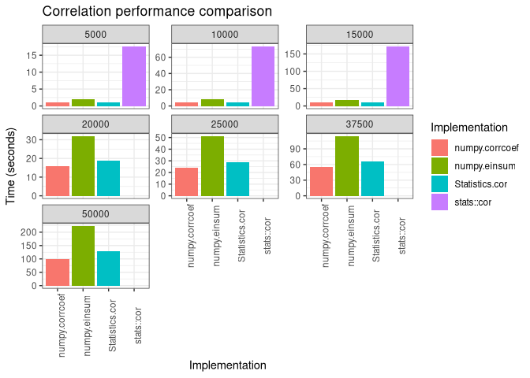
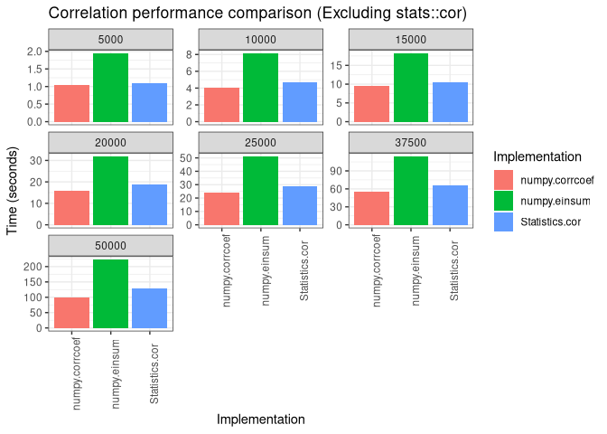
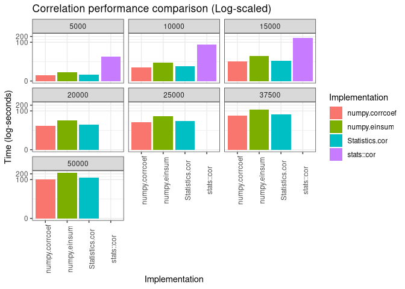

Julia/R/Python Correlation Performance Benchmark Results Summary
================
2021-01-21

``` r
library(tidyverse)
```

# Overview

``` r
res <- read_csv('/data/benchmark/correlation/jan2021/timings/all_timings.csv', col_types = cols())

# exclude single spearman cor results;
# will reconsider these later once other methods of computing spearman correlation have
# been added.
res <- res %>%
  filter(Method == "Pearson")

knitr::kable(res, digits = 2)
```

| Method  | Language | Implementation | Num Rows | Time (Secs) |
|:--------|:---------|:---------------|---------:|------------:|
| Pearson | Python   | numpy.corrcoef |     5000 |        1.04 |
| Pearson | Python   | numpy.corrcoef |    10000 |        4.02 |
| Pearson | Python   | numpy.corrcoef |    15000 |        9.41 |
| Pearson | Python   | numpy.corrcoef |    20000 |       15.90 |
| Pearson | Python   | numpy.corrcoef |    25000 |       24.39 |
| Pearson | Python   | numpy.corrcoef |    37500 |       55.33 |
| Pearson | Python   | numpy.corrcoef |    50000 |       98.56 |
| Pearson | Python   | numpy.einsum   |     5000 |        1.94 |
| Pearson | Python   | numpy.einsum   |    10000 |        8.13 |
| Pearson | Python   | numpy.einsum   |    15000 |       18.18 |
| Pearson | Python   | numpy.einsum   |    20000 |       31.81 |
| Pearson | Python   | numpy.einsum   |    25000 |       51.03 |
| Pearson | Python   | numpy.einsum   |    37500 |      113.95 |
| Pearson | Python   | numpy.einsum   |    50000 |      222.55 |
| Pearson | R        | stats::cor     |     5000 |       17.57 |
| Pearson | R        | stats::cor     |    10000 |       73.20 |
| Pearson | R        | stats::cor     |    15000 |      171.43 |
| Pearson | Julia    | Statistics.cor |     5000 |        1.10 |
| Pearson | Julia    | Statistics.cor |    10000 |        4.66 |
| Pearson | Julia    | Statistics.cor |    15000 |       10.39 |
| Pearson | Julia    | Statistics.cor |    20000 |       18.68 |
| Pearson | Julia    | Statistics.cor |    25000 |       28.64 |
| Pearson | Julia    | Statistics.cor |    37500 |       66.07 |
| Pearson | Julia    | Statistics.cor |    50000 |      128.64 |

# Time (seconds)

``` r
ggplot(res, aes(x = Implementation, y = `Time (Secs)`, fill = Implementation)) +
  geom_bar(stat = 'identity') + 
  facet_wrap(~`Num Rows`, scales = 'free_y') +
  theme_bw() +
  theme(axis.text.x = element_text(angle = 90)) +
  ggtitle("Correlation performance comparison") +
  ylab("Time (seconds)")
```

<!-- -->

# Time (seconds, excluding stats::cor)

``` r
res_subset <- res %>% 
  filter(Implementation != 'stats::cor')

ggplot(res_subset, aes(x = Implementation, y = `Time (Secs)`, fill = Implementation)) +
  geom_bar(stat = 'identity') + 
  facet_wrap(~`Num Rows`, scales = 'free_y') +
  theme_bw() +
  theme(axis.text.x = element_text(angle = 90)) +
  ggtitle("Correlation performance comparison (Excluding stats::cor)") +
  ylab("Time (seconds)")
```

<!-- -->

# Time (log-seconds)

``` r
ggplot(res, aes(x = Implementation, y = `Time (Secs)`, fill = Implementation)) +
  geom_bar(stat = 'identity') + 
  scale_y_continuous(trans='log1p') +
  facet_wrap(~`Num Rows`) +
  theme_bw() +
  theme(axis.text.x = element_text(angle = 90)) +
  ggtitle("Correlation performance comparison (Log-scaled)") +
  ylab("Time (log-seconds)")
```

<!-- -->
