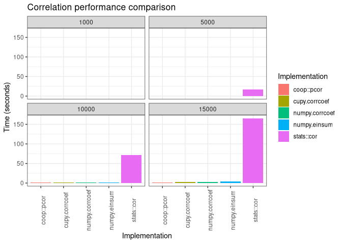
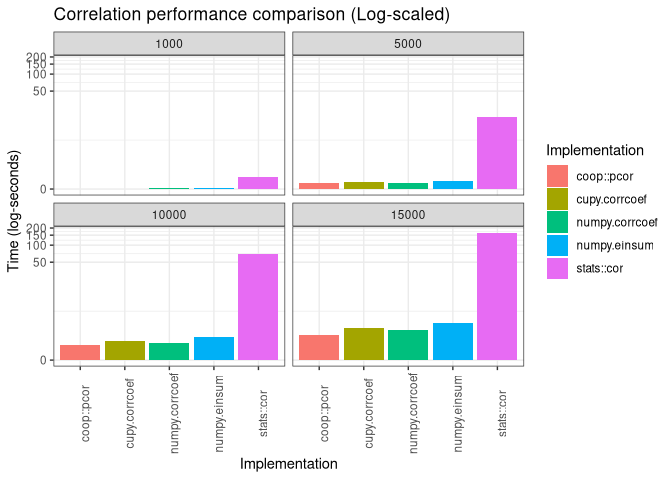

R/Python Correlation Performance Benchmark Results Summary
================
2019-12-23

``` r
library(tidyverse)
```

# Overview

``` r
res <- read_csv('/data/benchmark/correlation/timings/all_timings.csv')
```

    ## Parsed with column specification:
    ## cols(
    ##   Method = col_character(),
    ##   Language = col_character(),
    ##   Implementation = col_character(),
    ##   `Num Rows` = col_double(),
    ##   `Time (Secs)` = col_double()
    ## )

``` r
knitr::kable(res, digits = 2)
```

| Method  | Language | Implementation | Num Rows | Time (Secs) |
| :------ | :------- | :------------- | -------: | ----------: |
| Pearson | Python   | numpy.corrcoef |     1000 |        0.05 |
| Pearson | Python   | numpy.corrcoef |     5000 |        0.28 |
| Pearson | Python   | numpy.corrcoef |    10000 |        1.01 |
| Pearson | Python   | numpy.corrcoef |    15000 |        2.32 |
| Pearson | Python   | numpy.einsum   |     1000 |        0.03 |
| Pearson | Python   | numpy.einsum   |     5000 |        0.41 |
| Pearson | Python   | numpy.einsum   |    10000 |        1.48 |
| Pearson | Python   | numpy.einsum   |    15000 |        3.49 |
| Pearson | R        | stats::cor     |     1000 |        0.65 |
| Pearson | R        | stats::cor     |     5000 |       17.18 |
| Pearson | R        | stats::cor     |    10000 |       70.98 |
| Pearson | R        | stats::cor     |    15000 |      165.36 |
| Pearson | R        | coop::pcor     |     1000 |        0.02 |
| Pearson | R        | coop::pcor     |     5000 |        0.29 |
| Pearson | R        | coop::pcor     |    10000 |        0.86 |
| Pearson | R        | coop::pcor     |    15000 |        1.71 |
| Pearson | Python   | cupy.corrcoef  |     1000 |        0.02 |
| Pearson | Python   | cupy.corrcoef  |     5000 |        0.30 |
| Pearson | Python   | cupy.corrcoef  |    10000 |        1.15 |
| Pearson | Python   | cupy.corrcoef  |    15000 |        2.60 |

# Time (seconds)

``` r
ggplot(res, aes(x = Implementation, y = `Time (Secs)`, fill = Implementation)) +
  geom_bar(stat = 'identity') + 
  facet_wrap(~`Num Rows`) +
  theme_bw() +
  theme(axis.text.x = element_text(angle = 90)) +
  ggtitle("Correlation performance comparison") +
  ylab("Time (seconds)")
```

<!-- -->

# Time (seconds, excluding stats::cor)

``` r
res_subset <- res %>% 
  filter(Implementation != 'stats::cor')

ggplot(res_subset, aes(x = Implementation, y = `Time (Secs)`, fill = Implementation)) +
  geom_bar(stat = 'identity') + 
  facet_wrap(~`Num Rows`) +
  theme_bw() +
  theme(axis.text.x = element_text(angle = 90)) +
  ggtitle("Correlation performance comparison (Excluding stats::cor)") +
  ylab("Time (seconds)")
```

<!-- -->

# Time (log-seconds)

``` r
ggplot(res, aes(x = Implementation, y = `Time (Secs)`, fill = Implementation)) +
  geom_bar(stat = 'identity') + 
  scale_y_continuous(trans='log1p') +
  facet_wrap(~`Num Rows`) +
  theme_bw() +
  theme(axis.text.x = element_text(angle = 90)) +
  ggtitle("Correlation performance comparison (Log-scaled)") +
  ylab("Time (log-seconds)")
```

<!-- -->
